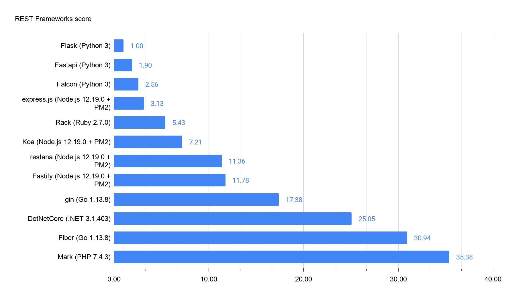

# rest-coin-benchmark
Simple REST frameworks benchmarking for a JSON coin toss

You can easily get it reading the code examples or, in Italian, have a look at [Confronto di server REST ad alte prestazioni](https://blog.kiwifarm.it/confronto-di-server-rest-ad-alte-prestazioni/).

## Note

Note: the [main developer](https://github.com/jkyberneees) of [restana](https://github.com/jkyberneees/restana) points [out that](https://github.com/carlok/rest-coin-benchmark/issues/3) we used its `body-parser` middleware, which is not optimised for performance, affecting express and restana results, so if you are a restana user and want a quicker response, try to prefer `GET` over `POST`. To be fair with the other listed frameworks, we'd have to rewrite the benchmarks for each of them using `GET` instead of `POST` and unfortunately we don't have time to do that.

## Thanks

* [Carlo Perassi](https://github.com/carlok) (Fastapi, Rack, Fastify, gin, Mark)
* [Alessandro Battezzati](https://github.com/alessandro-battezzati) (Flask, Falcon, express.js, Koa, restana, Fiber)
* [takeshelter](https://github.com/sheltertake) (DotNetCore)
